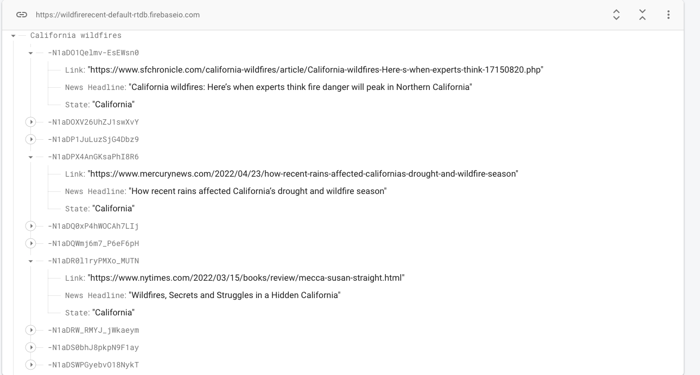

# DisasterNewsScraper. Fins News Related to a Specific Disaster in a Specific Location and stores them in Firebase for use.

<h2>
The script automaticaly scrapes Google news  stores them in firebase </h2>

<h1> How to use </h1>

<b> In main.py , type the configurations for your specific firebase instance. </b>

<b> In main.py , add , delete to the disasters array to keep track of more disasters. </b>

</b> In main.py , add , delete to the states array to keep track of more locations. </b>

<b> Sample Output </b>

